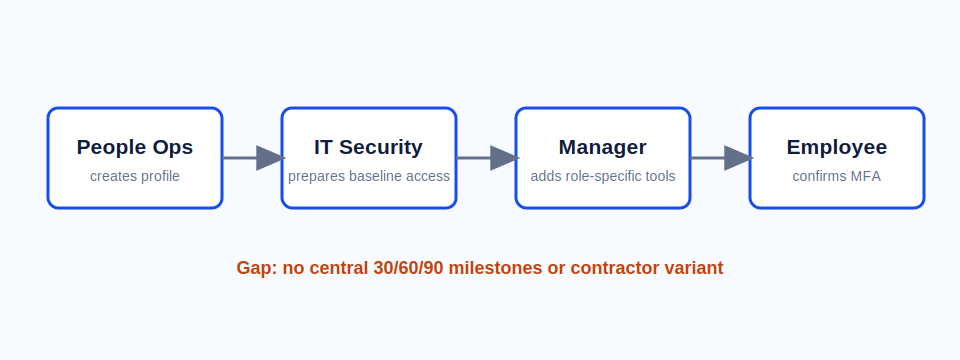

# New Employee First Week Guide

Owner: People Operations
Status: current but incomplete
Last reviewed: 2026-03-18

## Before Day One

People Operations creates the employee profile, sends the welcome email, and confirms shipping information for equipment. IT prepares laptop access and baseline application permissions.

## Day One

New employees attend orientation, complete required employment forms, enroll in payroll, and review the employee handbook.

Managers should schedule a 30-minute role expectations meeting on day one. The meeting should clarify team priorities, recurring rituals, and the first two weeks of work.

## First Week Checklist

- Join the team Slack channels.
- Confirm MFA is enabled on all required applications.
- Review the department knowledge area in VaultMind.
- Complete security awareness training.
- Meet the assigned onboarding buddy.
- Schedule first-week check-in with the manager.
- Confirm which role-specific systems are needed beyond the default access bundle.

## Ownership

People Operations owns the onboarding checklist. Managers own role-specific onboarding. IT owns access readiness and device support.

## Known Missing Pieces

This page does not define a complete 30/60/90 plan. Managers often keep role plans in team folders, so the central handbook cannot answer every new hire milestone question yet.

The default access bundle is not listed here. New hires in Sales, Customer Success, Product, and Data Analytics may need additional tools, but the owner should check `it-security/software-access-catalog.md` before requesting access.

There is no approved onboarding checklist for contractors or temporary workers. People Operations is tracking that as a separate documentation gap.
